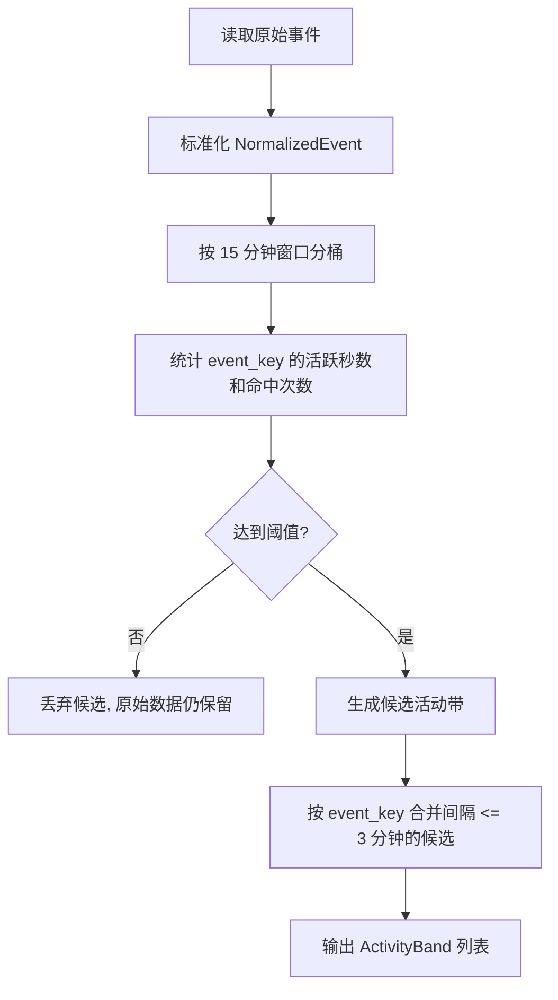

# Winflow 活动带版本开发文档

> 角色定位：本文件是 Winflow 下一阶段的开发总纲。目标是把当前“原始事件流 MVP”升级为“活动带时间线”，让用户能像看 Git graph 一样，从时间轴角度理解自己一天中在做什么。

---

## 1. 项目目标

Winflow 不是精确工时统计工具，也不是监控软件。它的核心目标是：

> 通过本地采集和规则聚合，生成一天中的活动时间线，让用户能回看“某个时间点我在做什么”和“某件事大概持续了多久”。

当前 MVP 已实现：

- 前台窗口采集：`foreground_events`
- 浏览器历史同步：`browser_visits`
- SQLite 本地存储
- 本地 Web UI 查看原始时间线

下一版本目标：

- 新增“活动带 activity bands”聚合层
- 15 分钟分析窗口内允许多个事件并行存在
- 用阈值识别值得展示的事件
- 用间隔合并解决频繁切屏问题
- Web UI 支持“原始事件 / 活动带”两种视图

---

## 2. 核心产品理念

### 2.1 不追求秒级精确

我们不需要回答：

```text
Chrome 精确用了 37 分 12 秒。
```

而是回答：

```text
09:15 - 10:05 你主要在研究 Dayflow 项目。
09:25 - 09:55 你反复查看 GitHub / README / Swift 相关内容。
09:40 - 10:10 你在编辑 Winflow 采集器。
```

### 2.2 一段时间允许多个事件

一个 15 分钟区间内可以同时存在：

- VS Code 编辑代码
- Chrome 查文档
- PowerShell 跑命令
- 微信短暂沟通

这些不是互斥的，而是并行的活动线。

### 2.3 解决频繁切屏

频繁切屏不应该把时间线切成碎片。

例如原始事件：

```text
10:00 - 10:04 Code.exe
10:04 - 10:05 Chrome.exe
10:05 - 10:09 Code.exe
10:09 - 10:10 PowerShell.exe
10:10 - 10:15 Code.exe
```

活动带应更接近：

```text
10:00 - 10:15 Code.exe / winflow 开发
10:04 - 10:10 Chrome / PowerShell 作为辅助事件出现
```

---

## 3. 本版本需求范围

### 3.1 必做需求

1. 生成活动带
   - 从 `foreground_events` 和 `browser_visits` 读取原始数据
   - 按 15 分钟窗口统计事件活跃度
   - 满足阈值后生成候选活动带
   - 同一事件间隔不超过 3 分钟时合并

2. 支持两类事件
   - 应用事件：来自 `foreground_events`
   - 网页事件：来自 `browser_visits`

3. Web UI 新增活动带视图
   - 默认显示活动带
   - 提供入口查看原始事件
   - 活动带支持并行展示

4. API 新增
   - `GET /api/bands?day=YYYY-MM-DD`
   - `GET /api/timeline?day=YYYY-MM-DD&mode=raw|bands` 可选增强

5. 测试
   - 聚合规则单元测试
   - A-B-A 频繁切屏合并测试
   - 浏览器访问次数阈值测试
   - Web API 基础测试

### 3.2 暂不做需求

本阶段不做：

- 截屏
- OCR
- AI 总结
- 托盘后台
- 开机自启
- 云同步
- 账号系统
- 复杂分类体系

这些功能后续可基于活动带继续扩展。

---

## 4. 技术栈

当前阶段继续保持轻量，不引入不必要依赖。

### 4.1 后端 / 采集

- Python 3.10+
- 标准库优先
- `ctypes` 调 Windows API
- `sqlite3` 本地数据库
- `http.server.ThreadingHTTPServer` 本地 Web 服务

### 4.2 前端

- 原生 HTML / CSS / JavaScript
- 暂不引入 React / Vue
- 目标是快速验证交互和数据结构

### 4.3 数据库

- SQLite
- WAL 模式
- 当前数据库路径：

```text
C:\Users\28377\Desktop\winflow\data\winflow.sqlite
```

### 4.4 后续可选技术

后续稳定后可考虑：

- FastAPI：替代简易 HTTP server
- Tauri / C# WPF：桌面壳
- Ollama / LM Studio：本地 AI 总结
- pytest：系统化测试框架

当前版本为了方便 subagent 开发，可以先用标准库 `unittest`。

---

## 5. 当前项目结构

```text
C:\Users\28377\Desktop\winflow
  app
    __init__.py
    browser_history.py      # 浏览器历史读取
    config.py               # 全局配置
    main.py                 # CLI + Web UI + API
    storage.py              # SQLite 存储
    timeline.py             # 原始时间线构建
    windows_activity.py     # Windows 前台窗口采集
  data
    winflow.sqlite
  docs
    DEVELOPMENT_PLAN.md     # 本文档
  README.md
  requirements.txt
```

下一版本建议新增：

```text
  app
    activity_bands.py       # 活动带聚合核心逻辑
    event_normalizer.py     # 可选：统一不同来源事件
  tests
    test_activity_bands.py
    test_timeline_api.py
```

---

## 6. 活动带算法设计

### 6.1 基础概念

#### Raw Event 原始事件

来自数据库的原始记录。

应用事件：

```text
foreground_events
start_ts
end_ts
process_name
window_title
exe_path
```

网页事件：

```text
browser_visits
visit_ts
browser
profile
url
title
```

#### Normalized Event 标准事件

建议统一成：

```python
@dataclass(frozen=True)
class NormalizedEvent:
    event_key: str
    event_type: str      # app | web
    start_ts: int
    end_ts: int
    title: str
    subtitle: str
    detail: str
    source: str
```

示例：

```text
app:Code.exe
app:chrome.exe
web:github.com
web:learn.microsoft.com
web:stackoverflow.com
```

#### Activity Band 活动带

最终展示单元：

```python
@dataclass
class ActivityBand:
    event_key: str
    event_type: str
    start_ts: int
    end_ts: int
    title: str
    subtitle: str
    detail: str
    total_active_seconds: int
    hit_count: int
    sample_titles: list[str]
    sample_details: list[str]
```

---

### 6.2 参数配置

新增到 `app/config.py`：

```python
ACTIVITY_BUCKET_SECONDS = 15 * 60
ACTIVITY_MIN_ACTIVE_SECONDS = 3 * 60
ACTIVITY_MIN_HIT_COUNT = 5
ACTIVITY_MERGE_GAP_SECONDS = 3 * 60
ACTIVITY_POINT_EVENT_SECONDS = 30
ACTIVITY_MAX_SAMPLE_COUNT = 5
```

含义：

| 参数 | 默认值 | 说明 |
|---|---:|---|
| `ACTIVITY_BUCKET_SECONDS` | 900 | 15 分钟分析窗口 |
| `ACTIVITY_MIN_ACTIVE_SECONDS` | 180 | 单个桶内停留超过 3 分钟才成带 |
| `ACTIVITY_MIN_HIT_COUNT` | 5 | 点事件访问次数超过 5 次也成带 |
| `ACTIVITY_MERGE_GAP_SECONDS` | 180 | 同事件间隔 3 分钟内合并 |
| `ACTIVITY_POINT_EVENT_SECONDS` | 30 | 浏览器点事件估算活跃时长 |
| `ACTIVITY_MAX_SAMPLE_COUNT` | 5 | 标题/URL 样本最多保留数 |

---

### 6.3 处理流程



---

### 6.4 分桶规则

给定日期 `day`，生成从当天 00:00 到 23:59:59 的窗口。

例如：

```text
09:00 - 09:15
09:15 - 09:30
09:30 - 09:45
```

应用事件和窗口求交集：

```text
event: 09:05 - 09:25 Code.exe
bucket 09:00 - 09:15 贡献 10 分钟
bucket 09:15 - 09:30 贡献 10 分钟
```

浏览器访问是点事件：

```text
visit: 09:06 github.com
```

在桶中贡献：

```text
hit_count += 1
active_seconds += ACTIVITY_POINT_EVENT_SECONDS
```

注意：点事件的 active_seconds 只是为了排序和展示，不代表真实停留时间。

---

### 6.5 候选活动带生成规则

每个桶内，每个 `event_key` 满足以下任一条件：

```text
total_active_seconds >= 180
或
hit_count >= 5
```

则生成候选带：

```text
start_ts = 该事件在桶内首次出现时间
end_ts = 该事件在桶内最后出现时间
```

为避免点事件 start/end 相同，浏览器访问可以扩展：

```text
start_ts = first_visit_ts
end_ts = max(last_visit_ts, first_visit_ts + 30)
```

---

### 6.6 合并规则

对候选带按 `event_key` 分组，按开始时间排序。

如果相邻两个同 `event_key` 的带：

```text
next.start_ts - current.end_ts <= 180
```

则合并：

```text
current.end_ts = max(current.end_ts, next.end_ts)
current.total_active_seconds += next.total_active_seconds
current.hit_count += next.hit_count
sample_titles 合并去重
sample_details 合并去重
```

如果间隔大于 3 分钟，则保留为两条带。

---

## 7. Web UI 设计

### 7.1 页面目标

Web UI 应支持两个视角：

1. 时间轴视角
   - 像 Git graph 一样看一天中的活动线
   - 多个活动可以并行出现

2. 事件视角
   - 按事件聚合
   - 查看某个 app / domain 大概持续了多久

### 7.2 MVP UI 要求

当前不追求复杂图形，先实现可用版：

- 顶部日期选择
- 视图切换：`活动带` / `原始事件`
- 活动带列表：按 `start_ts` 排序
- 每条带显示：
  - 时间范围
  - 类型：应用 / 网页
  - 标题
  - 来源 app/domain
  - 活跃估算时长
  - 命中次数
  - 样本标题 / URL

### 7.3 API 设计

#### `GET /api/bands`

请求：

```text
/api/bands?day=2026-05-18
```

返回：

```json
{
  "day": "2026-05-18",
  "start_ts": 1779033600,
  "end_ts": 1779119999,
  "generated_at": 1779070000,
  "bands": [
    {
      "event_key": "app:Code.exe",
      "event_type": "app",
      "start_ts": 1779040800,
      "end_ts": 1779046200,
      "title": "Code.exe",
      "subtitle": "VS Code / Cursor / Antigravity 等",
      "detail": "...",
      "total_active_seconds": 3300,
      "hit_count": 14,
      "sample_titles": ["main.py - winflow", "activity_bands.py - winflow"],
      "sample_details": []
    }
  ],
  "stats": {
    "by_type": [],
    "top_bands": []
  }
}
```

#### `GET /api/timeline`

保留现有接口，不破坏兼容。

可选增强：

```text
/api/timeline?day=2026-05-18&mode=raw
/api/timeline?day=2026-05-18&mode=bands
```

---

## 8. 数据库设计

本阶段建议先不新增持久化表，活动带实时计算即可。

理由：

- 规则还在迭代
- 实时计算方便调试
- 原始数据已经持久化

后续稳定后可以新增缓存表：

```sql
CREATE TABLE activity_bands_cache (
  id INTEGER PRIMARY KEY AUTOINCREMENT,
  day TEXT NOT NULL,
  event_key TEXT NOT NULL,
  event_type TEXT NOT NULL,
  start_ts INTEGER NOT NULL,
  end_ts INTEGER NOT NULL,
  title TEXT NOT NULL,
  subtitle TEXT,
  detail TEXT,
  total_active_seconds INTEGER NOT NULL,
  hit_count INTEGER NOT NULL,
  sample_titles_json TEXT,
  sample_details_json TEXT,
  rules_version TEXT NOT NULL,
  created_at INTEGER NOT NULL
);
```

本阶段不需要实现。

---

## 9. 测试策略

### 9.1 测试原则

- 聚合算法必须可纯函数测试
- 不依赖真实浏览器历史
- 不依赖真实前台窗口
- 使用临时 SQLite 或直接构造事件对象

### 9.2 必测用例

#### 用例 1：停留超过 3 分钟生成活动带

输入：

```text
09:00 - 09:04 Code.exe
```

期望：

```text
生成 app:Code.exe 活动带
```

#### 用例 2：停留不足 3 分钟不生成

输入：

```text
09:00 - 09:02 Code.exe
```

期望：

```text
不生成活动带
```

#### 用例 3：3 分钟内访问超过 5 次生成网页活动带

输入：

```text
09:00 github.com
09:01 github.com
09:01 github.com
09:02 github.com
09:02 github.com
```

期望：

```text
生成 web:github.com 活动带
```

#### 用例 4：A-B-A 频繁切屏合并

输入：

```text
09:00 - 09:05 Code.exe
09:05 - 09:06 WeChat.exe
09:06 - 09:12 Code.exe
```

期望：

```text
Code.exe 合并为 09:00 - 09:12
WeChat.exe 因不足阈值不显示或单独作为短事件候选被过滤
```

#### 用例 5：同事件间隔超过 3 分钟不合并

输入：

```text
09:00 - 09:05 Code.exe
09:10 - 09:15 Code.exe
```

期望：

```text
生成两条 Code.exe 活动带
```

#### 用例 6：跨 15 分钟窗口仍能自然合并

输入：

```text
09:10 - 09:25 Code.exe
```

期望：

```text
最终显示一条 09:10 - 09:25 Code.exe
```

---

## 10. 子模块拆分与 subagent 任务

下面按可并行开发的方式拆分。每个 subagent 应只负责自己的文件范围，避免互相覆盖。

---

### Agent A：活动带核心算法

#### 负责文件

```text
C:\Users\28377\Desktop\winflow\app\activity_bands.py
C:\Users\28377\Desktop\winflow\app\config.py
```

#### 任务

1. 在 `config.py` 新增活动带参数
2. 新建 `activity_bands.py`
3. 定义：
   - `NormalizedEvent`
   - `ActivityBand`
   - `normalize_foreground_rows(rows)`
   - `normalize_browser_rows(rows)`
   - `build_activity_bands(day: str | None = None) -> dict`
4. 实现：
   - 15 分钟分桶
   - 活跃秒数统计
   - 访问次数统计
   - 阈值过滤
   - 同事件 3 分钟间隔合并

#### 验收标准

- 可以独立调用：

```python
from app.activity_bands import build_activity_bands
print(build_activity_bands())
```

- 返回结构可 JSON 序列化
- 不修改现有 `timeline.py` 行为

---

### Agent B：测试用例

#### 负责文件

```text
C:\Users\28377\Desktop\winflow\tests\test_activity_bands.py
C:\Users\28377\Desktop\winflow\tests\__init__.py
```

#### 任务

1. 使用 `unittest`
2. 构造纯内存事件对象测试核心算法
3. 覆盖第 9 节中的 6 个必测用例
4. 如果 Agent A 提供了纯函数，例如 `build_bands_from_events(events, ...)`，优先测试纯函数

#### 验收标准

运行：

```powershell
cd C:\Users\28377\Desktop\winflow
python -m unittest discover -s tests
```

全部通过。

---

### Agent C：API 集成

#### 负责文件

```text
C:\Users\28377\Desktop\winflow\app\main.py
```

#### 任务

1. 新增 `/api/bands`
2. 保持 `/api/timeline` 不破坏
3. 可选：支持 `/api/timeline?mode=bands`
4. 新增 CLI：

```powershell
python -m app.main bands
python -m app.main bands --day 2026-05-18
```

#### 验收标准

- `python -m app.main serve` 后访问：

```text
http://127.0.0.1:8765/api/bands
```

返回 JSON。

- 现有命令仍可用：

```powershell
python -m app.main once
python -m app.main export
```

---

### Agent D：Web UI 活动带视图

#### 负责文件

```text
C:\Users\28377\Desktop\winflow\app\main.py
```

注意：与 Agent C 同文件，需串行开发，或由主控最后合并。

#### 任务

1. 页面新增视图切换按钮：
   - 活动带
   - 原始事件
2. 默认加载 `/api/bands`
3. 活动带显示：
   - 时间范围
   - app/web 标签
   - 标题
   - 活跃估算分钟
   - 命中次数
   - 样本标题/URL
4. 原始事件视图保留当前 `/api/timeline` 展示

#### 验收标准

- 页面默认不再被频繁切屏碎片刷屏
- 能切回原始事件视图
- 日期选择仍可用

---

### Agent E：文档与使用说明

#### 负责文件

```text
C:\Users\28377\Desktop\winflow\README.md
C:\Users\28377\Desktop\winflow\docs\DEVELOPMENT_PLAN.md
```

#### 任务

1. 更新 README，说明活动带版本
2. 补充命令说明
3. 解释活动带规则：
   - 15 分钟窗口
   - 3 分钟停留阈值
   - 5 次访问阈值
   - 3 分钟合并间隔
4. 加入隐私说明：
   - 数据本地保存
   - 当前不截屏
   - 浏览器历史只读复制副本

#### 验收标准

- 新用户按 README 可以启动采集和查看活动带
- 文档不承诺尚未实现的 AI / 截屏 / 托盘功能

---

## 11. 推荐开发顺序

建议顺序：

```text
1. Agent A：核心算法
2. Agent B：测试核心算法
3. Agent C：API 集成
4. Agent D：Web UI
5. Agent E：文档收尾
```

其中 A 和 B 可以并行，但 B 需要根据 A 暴露的函数名做小幅调整。

C 和 D 都会修改 `app/main.py`，建议串行，避免冲突。

---

## 12. 代码质量要求

1. 不引入新依赖，除非有明确必要
2. 不破坏现有 CLI 命令
3. 原始数据必须保留，不在聚合层删除记录
4. 聚合规则参数放到 `config.py`
5. 算法尽量纯函数化，方便测试
6. API 返回必须可 JSON 序列化
7. 时间统一使用 Unix seconds，本地展示再格式化
8. 避免在日志中输出过长 URL 或窗口标题

---

## 13. 风险点

### 13.1 浏览器历史是点事件

浏览器历史只能证明访问发生过，不能证明停留多久。

解决：

- 用 hit_count 判断反复访问
- 用 `ACTIVITY_POINT_EVENT_SECONDS` 做估算，不当成精确时长

### 13.2 15 分钟窗口边界可能切断活动

解决：

- 分桶只用于判断活动是否成立
- 最终显示用真实 first/last 时间
- 跨桶同事件通过 3 分钟间隔合并

### 13.3 app 级 event_key 可能过粗

例如：

```text
app:chrome.exe
```

太粗。

解决：

- Web 事件使用 domain 作为 key
- 应用事件后续可根据窗口标题提取项目名
- 当前版本先保持简单

### 13.4 同名事件主题不同

例如 GitHub 同一天访问多个仓库。

解决：

- 当前使用 domain 级 key
- 后续可升级为 `github.com/org/repo` 级 key

---

## 14. 后续路线

活动带稳定后，再考虑：

1. 规则分类
   - 开发
   - 文档
   - 通讯
   - 娱乐

2. AI 标题生成
   - 输入活动带和样本标题
   - 输出自然语言标题

3. 托盘后台运行

4. 开机自启

5. 可选截屏 / OCR

6. 长期趋势
   - 周视图
   - 月视图
   - 项目维度统计

---

## 15. 当前版本定义完成标准

本版本完成时，应满足：

- 运行 `python -m app.main collect` 能持续采集
- 运行 `python -m app.main serve` 能打开 Web UI
- 默认 UI 显示活动带，不是碎片原始事件
- 用户频繁切屏时，主活动不会被切碎
- 同一事件 3 分钟内再次出现会被合并
- 浏览器某域名 15 分钟内访问超过 5 次会形成活动带
- 所有核心聚合测试通过

---

## 16. 给 subagent 的通用提示词

可直接复制给每个 subagent：

```text
你正在开发 C:\Users\28377\Desktop\winflow。请先阅读 docs\DEVELOPMENT_PLAN.md。
只修改你负责的文件，不要重写无关模块。
保持现有 CLI 可用：python -m app.main init/once/collect/serve/export。
本阶段不引入新依赖，优先使用 Python 标准库。
完成后说明你改了哪些文件、实现了什么、如何测试。
```
